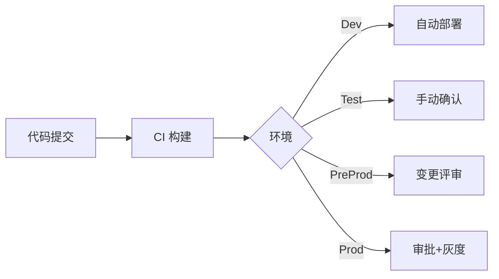

# 项目标准操作流程（SOP）

## 1. 项目克隆与初始化

### 1.1 克隆仓库
- **命令**：
  ```bash
  git clone git@your.git.server:your-group/your-project.git
  cd your-project
  ```
- **注意事项**：确认 SSH Key 已在 Git 服务器配置；如需走代理，提前设置 `GIT_SSH_COMMAND`。
- **判断标准**：`git status` 显示 `On branch main` 且无未跟踪文件。

### 1.2 初始化后端（Maven 多模块）
- **命令**：
  ```bash
  ./mvnw -pl blade-service,blade-ops -am clean install -DskipTests
  ```
- **注意事项**：首次执行需要确保 Maven Wrapper 权限执行 `chmod +x mvnw`；若无 Wrapper 使用 `mvn`。
- **判断标准**：`BUILD SUCCESS` 且本地 `.m2` 生成对应 jar。

### 1.3 初始化前端（Vue3 + Element Plus + TDDesign）
- **命令**：
  ```bash
  cd frontend
  npm install --registry=https://registry.npmmirror.com
  ```
- **注意事项**：按需替换镜像源；需要 Node.js ≥ 18.x。
- **判断标准**：`node_modules` 目录存在且 `npm ls` 无严重错误。

### 1.4 初始化 Flutter PDA
- **命令**：
  ```bash
  cd pda_app
  flutter pub get
  ```
- **注意事项**：需提前配置 Flutter SDK 与 Android/iOS Toolchain；国内网络使用 `PUB_HOSTED_URL` 和 `FLUTTER_STORAGE_BASE_URL`。
- **判断标准**：命令输出 `Running "flutter pub get" in pda_app... 0.7s`。

## 2. 本地开发流程

### 2.1 后端服务运行
1. **环境变量配置**
   ```bash
   cp env/.env.dev.example env/.env.local
   export SPRING_PROFILES_ACTIVE=dev
   export NACOS_ADDR=http://localhost:8848
   export MYSQL_URL=jdbc:mysql://localhost:3306/project_dev
   export REDIS_URL=redis://localhost:6379
   ```
   - 注意：所有敏感信息用 `env/.env.local` 管理，禁止提交。
   - 判断：`printenv SPRING_PROFILES_ACTIVE` 输出 `dev`。
2. **启动命令**
   ```bash
   ./mvnw -pl blade-service -am spring-boot:run
   ```
   - 注意：Flowable 需要数据库初始化；首次启动需执行数据库迁移。
   - 判断：`Started BladeApplication` 日志出现且 `http://localhost:8080/actuator/health` 返回 `{"status":"UP"}`。

### 2.2 前端 (Vue3) 运行
1. **环境变量**
   ```bash
   cp .env.development.example .env.local
   echo "VITE_API_BASE=http://localhost:8080" >> .env.local
   ```
   - 注意：`.env.local` 加入 `.gitignore`。
   - 判断：`cat .env.local` 包含 `VITE_API_BASE`。
2. **启动命令**
   ```bash
   npm run dev
   ```
   - 注意：默认端口 `5173`，冲突时使用 `npm run dev -- --port 5174`。
   - 判断：浏览器访问 `http://localhost:5173` 页面正常加载。

### 2.3 PDA Flutter 运行
1. **环境变量**
   ```bash
   cp .env.example .env
   flutter pub run build_runner build --delete-conflicting-outputs
   ```
   - 注意：Flutter 使用 `flutter_dotenv` 读取配置；需在设备上设置相同 API 地址。
   - 判断：`lib/.env` 被正确加载（`flutter run` 控制台显示变量）。
2. **运行命令**
   ```bash
   flutter run -d emulator-5554 --dart-define=API_BASE=http://10.0.2.2:8080
   ```
   - 注意：真机需保持同网段；如使用 iOS，改为 `flutter run -d ios`。
   - 判断：应用启动后登录接口正常返回。

### 2.4 调试方式
- **后端**：使用 IDEA/VSCode Remote Debug。
  ```bash
  ./mvnw -pl blade-service -am spring-boot:run -Dspring-boot.run.jvmArguments="-agentlib:jdwp=transport=dt_socket,server=y,suspend=n,address=*:5005"
  ```
  - 注意：防火墙需开放 5005。
  - 判断：IDE 能成功附加调试。
- **前端**：Chrome DevTools + Vite HMR。
  ```bash
  npm run dev -- --host
  ```
  - 注意：跨域问题使用代理 `vite.config.ts`。
  - 判断：`Vite` 控制台 `hot updated`。
- **Flutter**：启用 DevTools。
  ```bash
  flutter pub global activate devtools
  devtools
  ```
  - 注意：确保 `PATH` 包含 `~/.pub-cache/bin`。
  - 判断：浏览器打开 DevTools 页面。

## 3. 单元测试流程
- **后端**：
  ```bash
  ./mvnw -pl blade-service test
  ```
  - 注意：若使用 H2 内存库需配置 `application-test.yml`。
  - 判断：`Tests run: X, Failures: 0`。
- **前端**：
  ```bash
  npm run test
  ```
  - 注意：使用 Vitest，需 Node ≥ 18。
  - 判断：输出 `PASS`。
- **Flutter**：
  ```bash
  flutter test
  ```
  - 注意：如需模拟器资源关闭其他运行应用。
  - 判断：输出 `All tests passed!`。

## 4. 构建流程

### 4.1 Maven 打包
```bash
./mvnw -pl blade-service,blade-ops -am clean package -DskipTests
```
- 注意：生产构建不可跳过测试；需带 `-Pprod`。
- 判断：`target/blade-service.jar` 生成。

### 4.2 前端打包
```bash
cd frontend
npm run build
```
- 注意：检查 `.env.production`；构建后在 `dist/`。
- 判断：`dist/index.html` 存在。

### 4.3 Flutter 构建
```bash
cd pda_app
flutter build apk --dart-define=API_BASE=https://api.prod.example.com
```
- 注意：根据平台选择 `apk`, `appbundle`, `ipa`。
- 判断：`build/app/outputs/flutter-apk/app-release.apk` 生成。

## 5. Docker 镜像构建

### 5.1 Dockerfile 示例（后端）
```Dockerfile
FROM eclipse-temurin:17-jre-alpine
WORKDIR /app
COPY target/blade-service.jar app.jar
ENV JAVA_OPTS="-Xms512m -Xmx1024m"
EXPOSE 8080
ENTRYPOINT ["sh", "-c", "java $JAVA_OPTS -jar app.jar"]
```

### 5.2 构建 → 标记 → 推送
```bash
export IMAGE_REGISTRY=harbor.example.com/project
export APP_VERSION=1.0.0

# Build
docker build -t ${IMAGE_REGISTRY}/blade-service:${APP_VERSION} -f Dockerfile .

# Tag latest
docker tag ${IMAGE_REGISTRY}/blade-service:${APP_VERSION} ${IMAGE_REGISTRY}/blade-service:latest

# Login & Push
docker login harbor.example.com
docker push ${IMAGE_REGISTRY}/blade-service:${APP_VERSION}
docker push ${IMAGE_REGISTRY}/blade-service:latest
```
- 注意：确保 Harbor 项目权限；推送后在 UI 检查标签。
- 判断：`docker pull` 能成功拉取。

## 6. 发布流程



### 6.1 Dev 环境
1. **触发条件**：合并到 `develop`。
2. **部署命令**：
   ```bash
   kubectl config use-context k8s-dev
   kubectl apply -f k8s/dev/
   kubectl rollout status deployment/blade-service -n blade
   ```
3. **注意事项**：Dev 使用最新镜像 `:snapshot`；apply 后检查 ConfigMap 版本。
4. **判断标准**：`rollout status` 成功且 `kubectl get pods` 显示 `Running`。

### 6.2 Test 环境
1. **触发**：QA 提交部署单。
2. **步骤**：
   ```bash
   kubectl config use-context k8s-test
   kubectl apply -f k8s/test/
   kubectl get ingress -n blade
   ```
3. **注意事项**：使用测试数据库；通知 QA 清缓存。
4. **判断**：`/actuator/health` 返回 UP，QA 冒烟通过。

### 6.3 PreProd 环境
1. **触发**：变更评审通过。
2. **步骤**：
   ```bash
   kubectl config use-context k8s-preprod
   kubectl set image deployment/blade-service blade-service=${IMAGE_REGISTRY}/blade-service:${APP_VERSION} -n blade
   kubectl rollout status deployment/blade-service -n blade
   ```
3. **注意事项**：与 Prod 同步配置；使用真实第三方接口沙盒。
4. **判断**：`kubectl describe pod` 无异常事件；业务回归通过。

### 6.4 Prod 环境
1. **审批流程**：提交 CAB 单 → 安全部门审核 → 运维审批。
2. **部署命令**：
   ```bash
   kubectl config use-context k8s-prod
   kubectl set image deployment/blade-service blade-service=${IMAGE_REGISTRY}/blade-service:${APP_VERSION} -n blade --record
   kubectl rollout status deployment/blade-service -n blade --timeout=5m
   ```
3. **灰度策略**：先更新 10% 副本，监控 30 分钟。
   ```bash
   kubectl patch deployment blade-service -n blade -p '{"spec":{"replicas":10,"strategy":{"rollingUpdate":{"maxUnavailable":1,"maxSurge":1}}}}'
   ```
4. **回滚机制**：
   ```bash
   kubectl rollout undo deployment/blade-service -n blade --to-revision=<rev>
   ```
5. **注意事项**：确保 `configmap` 与 `secret` 版本正确；提前备份数据库。
6. **判断**：Grafana 监控指标稳定、APM 无异常、业务核心流程验证通过。

## 7. Kubernetes 部署说明

### 7.1 deployment.yaml 示例
```yaml
apiVersion: apps/v1
kind: Deployment
metadata:
  name: blade-service
  namespace: blade
spec:
  replicas: 3
  selector:
    matchLabels:
      app: blade-service
  template:
    metadata:
      labels:
        app: blade-service
    spec:
      containers:
        - name: blade-service
          image: harbor.example.com/project/blade-service:1.0.0
          ports:
            - containerPort: 8080
          envFrom:
            - configMapRef:
                name: blade-service-config
            - secretRef:
                name: blade-service-secret
          volumeMounts:
            - name: nfs-storage
              mountPath: /app/data
      volumes:
        - name: nfs-storage
          persistentVolumeClaim:
            claimName: blade-nfs-pvc
```

### 7.2 ConfigMap
```yaml
apiVersion: v1
kind: ConfigMap
metadata:
  name: blade-service-config
  namespace: blade
data:
  APPLICATION_ENV: "prod"
  NACOS_ADDR: "http://nacos:8848"
```
- 注意：ConfigMap 更新后需 `rollout restart`。

### 7.3 Secret
```yaml
apiVersion: v1
kind: Secret
metadata:
  name: blade-service-secret
  namespace: blade
type: Opaque
stringData:
  MYSQL_USERNAME: "blade"
  MYSQL_PASSWORD: "${MYSQL_PASSWORD}"
```
- 注意：敏感信息使用 CI 注入；避免明文。

### 7.4 NFS PVC/Volume
```yaml
apiVersion: v1
kind: PersistentVolume
metadata:
  name: blade-nfs-pv
spec:
  capacity:
    storage: 100Gi
  accessModes:
    - ReadWriteMany
  nfs:
    path: /data/blade
    server: nfs.example.com
---
apiVersion: v1
kind: PersistentVolumeClaim
metadata:
  name: blade-nfs-pvc
  namespace: blade
spec:
  accessModes:
    - ReadWriteMany
  resources:
    requests:
      storage: 100Gi
  storageClassName: ""
```
- 注意：Calico 网络下 NFS 需开放 2049 端口。

### 7.5 常用命令
```bash
kubectl apply -f k8s/prod/blade-service.yaml
kubectl rollout restart deployment/blade-service -n blade
kubectl get pods -n blade -o wide
kubectl logs deployment/blade-service -n blade --tail=100
```
- 判断：`rollout restart` 完成后 `kubectl get pods` 新版本 Running。

## 8. Rancher 发布流程
1. 登录 Rancher → 选择 Cluster (Dev/Test/PreProd/Prod)。
2. 进入 `Workloads` → `Deployments` → 选择 `blade-service`。
3. 点击 `Upgrade`。
4. 填写新镜像标签、环境变量、卷挂载。
5. 勾选 `Rollout Strategy`，确认 `Max Unavailable` 与 `Max Surge`。
6. 点击 `Save`，观察 `Pods` 状态变化。
7. 成功标准：Workload 状态显示 `Active`，Pods 全部 `Running`。
8. 注意：变更记录要在 `Activity` 中留档。

## 9. 数据库升级流程

### 9.1 Flyway 迁移
```bash
./mvnw -pl blade-service flyway:migrate -Dflyway.configFiles=flyway-prod.conf
```
- 注意：Flyway 脚本位于 `database/migration`；生产执行前在 PreProd 验证。
- 判断：输出 `Successfully applied X migrations`。

### 9.2 手动 SQL
1. 备份
   ```bash
   mysqldump -h mysql.prod -ublade -p --databases blade > backup_$(date +%F).sql
   ```
2. 执行
   ```bash
   mysql -h mysql.prod -ublade -p blade < scripts/20240101_add_index.sql
   ```
3. 验证
   ```bash
   mysql -h mysql.prod -ublade -p -e "SHOW INDEX FROM order_table"
   ```
- 注意：Prod 操作需双人复核；备份保留 7 天。

## 10. 回滚 SOP

### 10.1 Docker 镜像回滚
```bash
docker pull ${IMAGE_REGISTRY}/blade-service:${PREV_VERSION}
kubectl set image deployment/blade-service blade-service=${IMAGE_REGISTRY}/blade-service:${PREV_VERSION} -n blade --record
```
- 注意：确保旧镜像仍在 Harbor；记录 revision。

### 10.2 Kubernetes 回滚
```bash
kubectl rollout undo deployment/blade-service -n blade --to-revision=<rev>
```
- 注意：`kubectl rollout history` 查看历史。

### 10.3 配置回滚
```bash
kubectl get configmap blade-service-config -n blade -o yaml > backup.yaml
kubectl apply -f backup.yaml
kubectl rollout restart deployment/blade-service -n blade
```
- 注意：使用 GitOps 管理 ConfigMap，避免手动改动。

### 10.4 数据回滚风险
- 若使用全量备份：
  ```bash
  mysql -h mysql.prod -ublade -p blade < backup_2024-01-01.sql
  ```
- 风险：覆盖新增数据，需评估业务影响；推荐使用增量恢复或闪回。

## 11. 灰度发布流程
1. 准备灰度命名空间 `blade-canary`。
2. 部署 Canaries
   ```bash
   kubectl apply -f k8s/prod/blade-service-canary.yaml
   ```
3. 配置 Istio/NGINX Ingress 权重
   ```bash
   kubectl annotate ingress blade-service -n blade nginx.ingress.kubernetes.io/canary="true"
   kubectl annotate ingress blade-service -n blade nginx.ingress.kubernetes.io/canary-weight="20"
   ```
4. 监控 30 分钟。
5. 若指标正常，逐步提升权重至 100%。
6. 判断：Prometheus 指标（错误率 < 1%），业务成功率达标。

## 12. 生产环境监控流程
- **Prometheus**：
  ```bash
  kubectl port-forward svc/prometheus -n monitoring 9090:9090
  ```
  检查 `http_requests_total`、`jvm_memory_used_bytes`。
- **Grafana**：
  ```bash
  kubectl port-forward svc/grafana -n monitoring 3000:3000
  ```
  登录查看仪表盘 `Blade Service Overview`。
- 注意：设置告警规则，钉钉/Slack 通知。
- 判断：指标稳定，无持续告警。

## 13. 日志查看与排错
- **ELK**：Kibana 检索 `kubernetes.pod_name:blade-service-*`。
- **kubectl logs**：
  ```bash
  kubectl logs deployment/blade-service -n blade --tail=200
  kubectl logs pod/blade-service-xxxxx -n blade -c blade-service --previous
  ```
- **注意事项**：日志量大时使用 `--since=1h`；敏感数据需脱敏。
- **判断**：异常日志定位并解决，告警关闭。

---

# 《10 分钟速查版 SOP》

| 步骤 | 操作 | 命令/验证 |
| ---- | ---- | --------- |
| 克隆 | 拉代码 | `git clone ... && cd ...` |
| 后端 | 运行 | `./mvnw -pl blade-service -am spring-boot:run` → 健康检查 `curl localhost:8080/actuator/health` |
| 前端 | 运行 | `npm run dev` → 浏览器 5173 |
| Flutter | 运行 | `flutter run -d emulator-5554 --dart-define=API_BASE=http://10.0.2.2:8080` |
| 单测 | 后端 | `./mvnw test` → `Failures: 0` |
| 构建 | 后端 | `./mvnw clean package -DskipTests` |
| 构建 | 前端 | `npm run build` |
| 构建 | Flutter | `flutter build apk` |
| 镜像 | 构建 | `docker build -t harbor/...:${APP_VERSION} .` → `docker push` |
| Dev 部署 | `kubectl apply -f k8s/dev` → `rollout status` |
| Test 部署 | `kubectl apply -f k8s/test` → QA 冒烟 |
| PreProd | `kubectl set image ...:${APP_VERSION}` |
| Prod | `kubectl set image ... --record` → 灰度监控 |
| 回滚 | 镜像 | `kubectl rollout undo deployment/blade-service` |
| 监控 | Grafana | `kubectl port-forward svc/grafana 3000:3000` |
| 日志 | K8s | `kubectl logs deployment/blade-service -n blade` |

> 建议新人打印该表随身携带，遇到问题按章节回查详细 SOP。
